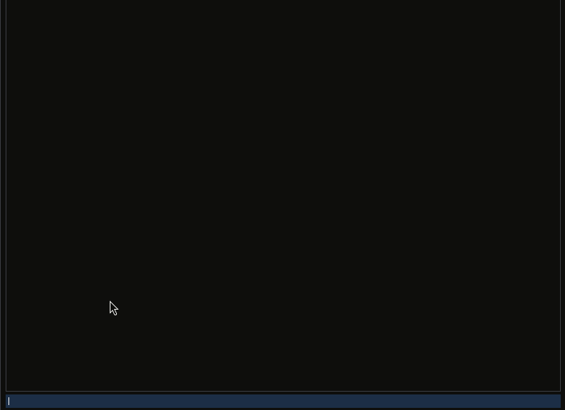
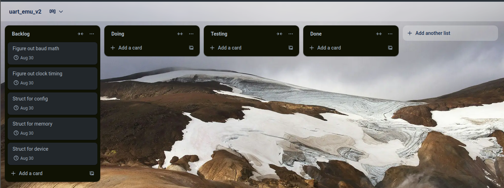
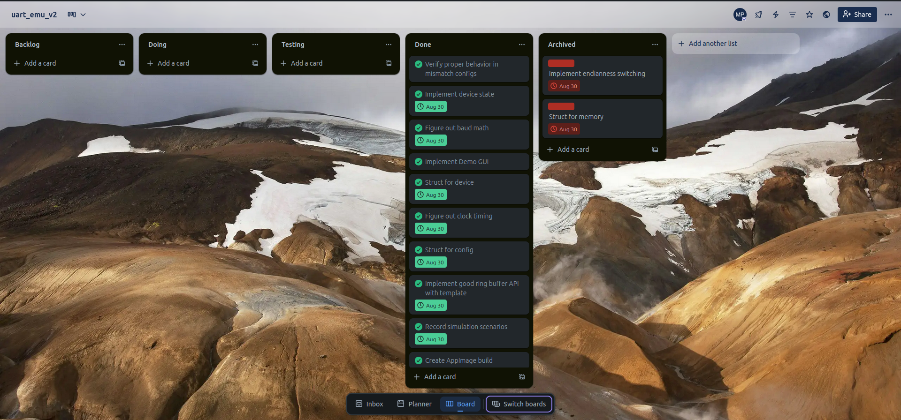

# UART_EMU_V2

## UART Simulation (C++ / Dear ImGUI Demo)

My UART device simulation project including a freestanding build and an ImGui demo simulating multiple UART devices. Developed on Linux with C++ and Make. Packaged in an AppImage for Linux.

## Table of Contents

- [Project Story](#project-story)
- [Project Features](#project-features)
- [Messaging Through UART Demo](#messaging-through-uart-demo)
- [Project Structure](#project-structure)
- [How To Build: Linux](#how-to-build-linux)
  - [System Tools](#system-tools)
  - [System Libraries (Required for Demo)](#system-libraries-required-for-demo)
  - [Compiler Options](#compiler-options)
  - [Complete Step-by-Step Build Guide](#complete-step-by-step-build-guide)
  - [Troubleshooting Common Issues](#troubleshooting-common-issues)
  - [Alternative: Quick Commands for Experienced Users](#alternative-quick-commands-for-experienced-users)
- [Project Management](#project-management)

## Project Story

Initially I wanted to take an OOP focused approach to build this device simulation but I ended up abusing abstraction principles and I couldn't keep the scope of the design contained. I focused on the procedural aspect of the code and the hard problems to solve such as: baud and clock timing, easily converting strings to bits, the connection of devices and visualizing it all in a demo. I ended up landing on a combination of structs and procedures that worked well, utilizing no standard library. 

## Project Features

- UART deterministic and discrete timing simulation
- Configurable UART Settings
- Frame validation from stop/start bit
- Bit-level transmission 
- ImGui demo with live logs of received text (fixed 63 character message sizes)
- Serial connection simulation
- Public kanban using [Trello](https://trello.com/b/4MSv9Ytv/uartemuv2)
- Freestanding build and hosted build for testing

## Messaging Through UART Demo



## Project Structure

```
UART_EMU_V2/
├── src/ # Core source files
│ ├── main.cpp # Freestanding entry point
│ ├── device.cpp # UART device implementation
│ ├── device.hpp # UART device definitions
│ ├── ring_buffer.hpp # Ring buffer template header
│ ├── ring_buffer.tpp # Ring buffer template implementation
│ └── crt0.S # Assembly startup code
├── demo/ # GUI demo application
│ └── uart_demo.cpp # ImGui UART emulator demo
├── tests/ # Unit tests
│ ├── device_test.cpp # Device functionality tests
│ └── ring_buffer_test.cpp # Ring buffer tests
├── imgui/ # Dear ImGui library (third-party)
├── release/ # Release scripts and packages
│ ├── linux/ # Linux release tools
│ │ ├── create-appimage.sh # AppImage creation script
│ │ ├── create-release.sh # GitHub release script
│ │ ├── appimage-builder.yml # AppImage configuration
│ │ ├── README-AppImage.md # AppImage documentation
│ │ └── UART_Emulator_Demo-0.1.0-x86_64.AppImage
│ └── RELEASE-GUIDE.md # Release instructions
├── repo_assets/ # Repository assets
├── build-appimage.sh # Root AppImage script
├── create-release.sh # Root release script
├── Makefile # Build configuration
├── README.md # This file
├── LICENSE # Project license
├── VERSION # Project version
├── .gitignore # Git ignore rules
└── imgui.ini # ImGui configuration
```

## How To Build: Linux

### System Tools

- **GNU Make** - 4.4.1
- **Git** - 2.48.1
- **GCC** - Primary C++ compiler (default) - 14.2.0
- **Zig Compiler** - Alternative C++ compiler - 0.13.0

### System Libraries (Required for Demo)

- **libglfw3-dev** - GLFW windowing library - 3.4.0
- **libgl1-mesa-dev** - OpenGL development libraries - 1.2
- **libdl2-dev** - Dynamic linking library
- **libpthread-stubs0-dev** - POSIX threads
- **GCC** - Alternative C++ compiler - 14.2.0

### Compiler Options

This project supports multiple C++ compilers:

- **G++** (default): `make demo` or `make use-gcc`
- **Zig**: `make COMPILER=zig demo` or `make use-zig`
- **Show current compiler**: `make show-compiler`

## **Complete Step-by-Step Build Guide**

**Note**: This guide is specifically for Debian-based Linux distributions (Ubuntu, Debian, Linux Mint, etc.) that use the `apt` package manager.

### **Step 1: Open Terminal**
**Method 1: Keyboard Shortcut (Most Common)**
1. **Press `Ctrl + Alt + T`** on your keyboard
2. A black window with white text will appear - this is your terminal

**Method 2: Application Menu**
1. Click the **Applications** or **Start** menu
2. Search for **"Terminal"** or **"Konsole"** or **"xterm"**
3. Click on the terminal application

**Method 3: Right-Click Menu**
1. Right-click on the desktop or in a folder you wish to clone this repository to
2. Look for **"Open Terminal"** or **"Open in Terminal"**

Once you have a terminal open, you'll see a command prompt ending with `$` - this is where you type commands.

### **Step 2: Install Required Software**
Copy and paste these commands one by one, pressing `Enter` after each:

```bash
# Update your system's package list
sudo apt update

# Install essential build tools
sudo apt install -y build-essential make git pkg-config

# Install graphics libraries (required for demo)
sudo apt install -y libglfw3-dev libgl1-mesa-dev libdl2-dev libpthread-stubs0-dev
```

**What this does**: Downloads and installs the software needed to build your project.

**Alternative**: After installing `make`, you can run `make dependencies` to automatically install all required packages.

### **Step 3: Install Zig Compiler (Optional)**
```bash
# Download Zig compiler
curl -L https://ziglang.org/download/latest/zig-linux-x86_64.tar.xz | tar -xJ

# Move Zig to a permanent location
sudo mv zig-linux-* /opt/zig

# Add Zig to your PATH (so your computer can find it)
echo 'export PATH="/opt/zig:$PATH"' >> ~/.bashrc

# Reload your terminal settings
source ~/.bashrc
```

**What this does**: Installs the Zig compiler as an alternative to GCC.

**Note**: Zig is optional! GCC is the default compiler and will be used automatically.

### **Step 4: Download The Project**
```bash
# Go to your Desktop folder
cd ~/Desktop

# Download (clone) your project from GitHub
git clone https://github.com/your-username/UART_EMU_V2.git

# Go into the project folder
cd UART_EMU_V2
```

**What this does**: Downloads your project files to your computer and moves you into the project folder.

### **Step 5: Verify Everything is Working**
```bash
# Check if GCC is installed
gcc --version

# Check if Make is installed
make --version

# Check if Git is installed
git --version
```

**Expected output**: You should see version numbers for each tool.

### **Step 6: Build the Freestanding Version**
```bash
# Clean any previous builds
make clean

# Build the freestanding (bare metal) version
make freestanding

# Check if it was created
ls bin/
```

**What this does**: Creates a standalone program that doesn't need an operating system.

**Expected output**: You should see `app` in the `bin/` folder.

### **Step 7: Build the Demo (GUI Application)**
```bash
# Build the ImGui demo application
make demo

# Check if it was created
ls bin/
```

**What this does**: Creates a graphical program with a user interface.

**Expected output**: You should see both `app` and `demo` in the `bin/` folder.

### **Step 8: Run the Demo**
```bash
# Run the demo program
./bin/demo
```

**What this does**: Starts your UART emulator with a graphical interface.

**Expected result**: A window should open showing your UART console interface.

### **Step 9: Test Different Compilers (Optional)**
```bash
# Switch to Zig compiler
make use-zig

# Switch back to G++ compiler (default)
make use-gcc

# See which compiler is currently active
make show-compiler
```

## **Troubleshooting Common Issues**

### **"Command not found" errors**
- **Solution**: You need to install the missing software. Go back to Step 2.

### **"Permission denied" errors**
- **Solution**: Make sure you typed `sudo` before the command.

### **"No such file or directory" errors**
- **Solution**: Make sure you're in the right folder. Type `pwd` to see your current location.

### **Build fails with errors**
- **Solution**: Try `make clean` then `make demo` again.

### **Demo window doesn't open**
- **Solution**: Make sure you have a desktop environment running (not just a terminal).

## **Alternative: Quick Commands for Experienced Users**

If you know what you're doing, here are the quick commands:

```bash
# Clone and build everything
git clone https://github.com/your-username/UART_EMU_V2.git
cd UART_EMU_V2
make all

# Or build specific targets
make freestanding  # Bare metal version
make demo          # GUI demo
make test          # Run tests
make clean         # Clean build files

# Install system dependencies (Debian/Ubuntu only)
make dependencies  # Installs all required packages
```

## Project Management

Since the beginning of the project I applied the Kanban project management methodology. The core components were made in a two week time frame and had a strict Aug 30th 2025 deadline.
I quickly realized that I had enough time to create the core systems for what I wanted to demo but had to drop some initial ideas.




